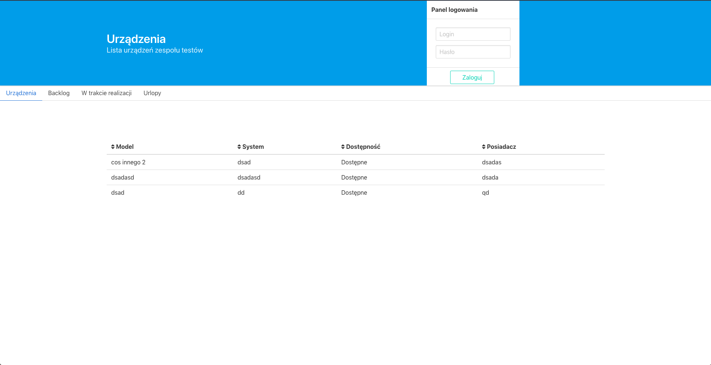

# ZT project

Projekt strony dla zespołu testów w Cyfrowym Polsacie (Nieoficjalna)

## TODO

1. - [x] Zrobić modal
		- [x] - Uzupełnianie go aktualnymi danymi 
		- [x] - Zrobić animacje
2. - [x] - Zrobić formularz dodawania urządzeń
3. - [x] Zrobić powiadomienia o zaktualizowaniu, dodaniu oraz usunieciu urzadzenia 
4. - [x] Zrobić sortowanie kolumn (Poprawić hover oraz refactor funkcji `sort`)
5. - [ ] Stworzyć podstrony `backlog` oraz `W trakcie realizacji` (trzeba pomyśleć jak miałoby to wyglądać)
6. - [ ] Kliknięcie wyświetla informację na temat urządzenia (Pomyśleć nad widokiem)
7. - [ ] Zrobić stronę z urlopami (Wypisane miesiące i mozna wpisywać kto kiedy ma urlop) 
8. - [ ] Zamienić SetInterval który jest `Pseudo RealTime` na `socket.io` lub uzyć `eventemitter` który faktycznie odświezy content gdy pojawi się nowy wpis na serwerze (przebudowa logiki aplikacj) - Obecnie aby zobaczyć zmiany trzbe odświezyć stronę
9. - [ ] Dodać `redux` do projektu który ułatwi komunikację między komponentami 
10. - [x] Zmienić formularz dodawania urządzeń, na ikonę `plus`, a po kliknięciu wyświetla się modal (Sprawdzić czy mozna skorzystać z istniejącego komponentu `DeviceModal`)
11. - [ ] Obsługa błędów
12. - [ ] PWA - https://piecioshka.pl/blog/2017/05/07/jak-przerobic-strone-na-pwa.html
13. - [ ] Przebudować serwer (utworzyć odpowiednie funkcje oraz callbacki)
14. - [ ] Server Side Rendering
15. - [x] Stworzyć model `User`
16. - [x] Przebudować serwer tak aby sprawdzał dane logowania
17. - [x] Dokończyć logowanie - Obecnie jeśli w `DeviceBox` zmienimy `credential` na `true` pojawiają się elementy widoczne po zalogowaniu
18. - [ ] Napisać testy dla komponentów oraz dla serwera

## How to use

```
$ npm run start-dev			# run server and react
$ npm start				# run react
$ npm run server			# run server
```

## Testowe konto do logowania
```
$ login: test
$ password: test123
```
## Screenshots

1. Zalogowany


2. Niezalogowany

